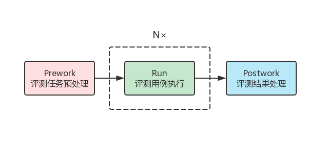

<h1 align="center">PyGrading</h1>

<p align="center">CourseGrading(希冀)计算机专业课一体化在线平台开发用Python工具包。包含通用评测内核创建以及HTML标签生成工具。</p>

<p align="center">
	<a href="http://www.educg.net/">
		
	</a>
	<a href="https://github.com/PhenomingZ/PyGrading">
		
	</a>
	<a href="https://pypi.org/project/pygrading/">
			
		</a>
	<a href="https://github.com/PhenomingZ/PyGrading/issues">
				
	</a>
	<a href="https://github.com/PhenomingZ/PyGrading/blob/master/LICENSE">
				
	</a>
</p>

<p align="center">
	<a href="#what-is-it">What is it</a> •
	<a href="#install">Install</a> •
	<a href="#getting-start">Getting Start</a> •
	<a href="http://www.educg.net/" target="_blank">Site</a>
</p>

<p align="center">
		
</p>

<h6 align="center">Made by Charles Zhang • :globe_with_meridians: <a href="https://github.com/PhenomingZ">https://github.com/PhenomingZ</a></h6>

<h2 id="what-is-it" align="center">What is it</h2>

**希冀平台** 是一个国内最具专业深度、安全可扩展的计算机类课程一体化支撑平台，是一个定位于全面支撑计算机、人工智能和大数据专业建设的大型综合教学实验平台，而非一个只能支撑若干门课程的实验系统。

**通用评测** 是一个通用的自动评测框架，基于该框架可以定制开发任何自己需要的自动评测内核。

**PyGrading工具包** 目前该工具包包含以下功能：
1. 支持CourseGrading平台通用评测内核快速构建；
2. 支持适用于通用评测题和虚拟桌面环境的评测结果JSON串的快速生成；
2. 支持HTML标签文本内容的快速生成，绝对好用的HTML生成工具；

希望使用本工具能够提高大家的工作效率，预祝各位开发顺利，成就感爆棚！

<h2 id="install" align="center">Install</h2>

使用pip可以轻松安装PyGrading：

```bash
pip install pygrading
```

也可以下载项目文件后，切换到`setup.py`所在的目录，执行以下命令来安装：

```bash
python setup.py install
```

PyGrading的运行环境要求 **Python >= 3.6**，不支持Python2。

<h2 id="getting-start" align="center">Getting Start</h2>

### 通用评测内核构建

#### 1. 设计逻辑

PyGrading采用三段式的设计逻辑，将每一次评测任务分为三个阶段，分别完成“评测任务预处理”、“评测用例执行”、“评测结果处理”，如下图所示：

<p align="center">
		
</p>

**评测任务预处理** 通常包括读取配置文件信息、读取评测用例信息、编译学生提交的文件等任务。

**评测用例执行** PyGrading会自动迭代执行评测用例列表中的每个评测用例，而具体的评测规则可以用一个函数快速指定。

**评测结果处理** 通常包括评测结果汇总、生成评测报告、输出评测结果JSON串等任务。

#### 2. 导入程序包

PyGrading安装完成之后，推荐在您的代码中使用如下方式导入通用评测相关模块：

```python
import pygrading.general_test as gg
```

如果您需要在评测结果中显示html内容，推荐如下方式导入html相关模块：

```python
from pygrading.html import *
```

